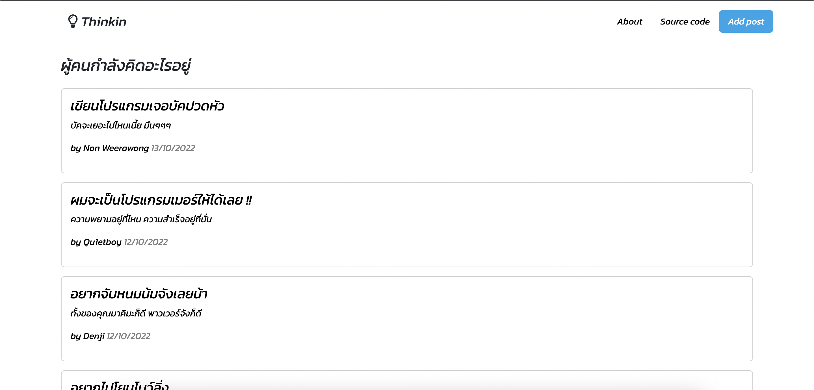
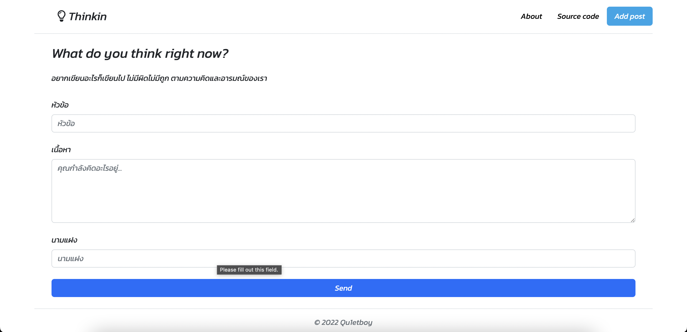

# 💡 Thinkin

NodeJS, Express, MySQL, CRUD application

## Screenshots




## Environment Variables

```
DB_NAME=
DB_HOST=
DB_PASSWORD=
DB_PORT=
DB_USER=
PORT=
```

## Database

- local: XAMPP (MySQL)
- prod: railway (MySQL)

## Backend

- NodeJS
- Express
- EJS

## Installation

download dependencies

```
npm install
```

run the project

```
npm run dev
```
